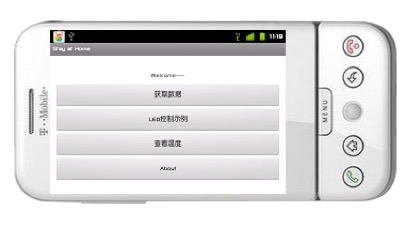

#开源物联网系统设计

> 这个项目的代码不再更新

相关文档可以参考这里: [一步步搭建物联网系统](http://designiot.phodal.com)

系统框架图: 

现有的这个版本是HTTP版，在线demo[http://b.phodal.com](http://b.phodal.com)。

[https://github.com/phodal/iot-coap](https://github.com/phodal/iot-coap)

[物联网相关资料收集](https://github.com/phodal/awesome-iot)

[吊兰-MQTT协议,CoAP协议,WebSocket,物联网协议](https://github.com/phodal/diaonan)

Android App:《教你设计物联网》

#Design Internet of Things 

A Minimum IOT with arduino and raspberry pi.

一个最小的物联网系统设计方案及源码

 - android/ 一个最小的Android程序实例
 - rest/ PHP Laravel Framework to create RESTful API
 - python/ 简单的pyhon示例
 - hardware/  硬件串口通信收集
 - doc/  文档 简介ppt nginx配置 系统框架图
 - dashboard/ 基于ruby框架dashing的dashboard

##Install

###直接下载

已打包好的: [https://github.com/phodal/iot/archive/0.9.5.zip](https://github.com/phodal/iot/archive/0.9.5.zip)

##测试

 1.将arduino/BareMinimum.ino 烧录到开发板上

 2.执行get.py (ps:如果用的是Windows系统 需要将get.py中的 /dev/ttyACM0 改为 COM*.)

    sudo python python/get.py

 3.打开 http://localhost/athome/create 创建一个数据。打开 http://localhost/athome/1/edit 编辑状态

 4.测试网址: [b.phodal.com][1]

##Android 示例

示例界面

项目主页: [IoT-Android](https://github.com/phodal/iot-android)

已测支持平台: ``HTC G1``,``Motor XT300``,``SONY ST25I``

主要依赖库: ``GSON``

  1.下载安装 [Stay at Home][13]

##论文展示

Phodal毕业论文: [https://github.com/phodal/thesis](https://github.com/phodal/thesis)

##交流

QQ群：348100589

##相关文档

[一个最小的物联网系统设计方案及源码][2]

[最小物联网系统（一）——系统组成][4]

[最小物联网系统（二）——RESTful][5]

[最小物联网系统（三）——创建RESTful][6]

[最小物联网系统（四）——详解Laravel的RESTful][7]

[最小物联网系统（五）——Laravel RESTful模板化][8]

[最小物联网系统（六）——Ajax打造可视化][9]

[最小物联网系统（七）——与服务器通讯][10]

[最小物联网系统（八）——与单片机通讯][11]

[最小物联网系统（九）——Android客户端][12]

[最小物联网系统设计——给Laravel添加测试][15]

[最小物联网系统——Dashboard][16]

##License

© 2014 [Phodal Huang][phodal]. This code is distributed under the MIT license.

[1]:http://b.phodal.com/
[2]:http://www.phodal.com/blog/bare-minimum-iot
[3]:https://github.com/gmszone/iot/wiki
[4]:http://www.phodal.com/blog/bare-minimum-iot-system-structure/
[5]:http://www.phodal.com/blog/bare-minimum-iot-system-restful/
[6]:http://www.phodal.com/blog/bare-minimum-iot-system-create-restful/
[7]:http://www.phodal.com/blog/bare-minimum-iot-system-about-restful/
[8]:http://www.phodal.com/blog/bare-minimum-iot-system-restful-template/
[9]:http://www.phodal.com/blog/bare-minimum-iot-system-ajax/
[10]:http://www.phodal.com/blog/bare-minimum-iot-system-date-commucation/
[11]:http://www.phodal.com/blog/bare-minimum-iot-system-mcu-commucation/
[12]:http://www.phodal.com/blog/bare-minimum-iot-system-android-example/
[13]:https://github.com/phodal/iot-android/raw/master/app/build/apk/app-debug-unaligned.apk
[14]:http://bbs.phodal.com/
[15]:http://www.phodal.com/blog/bare-minimum-iot-system-add-test-for-laravel/
[16]:http://www.phodal.com/blog/bare-minimum-iot-system-dashboard-framework-dashing/
[phodal]:http://www.phodal.com/

